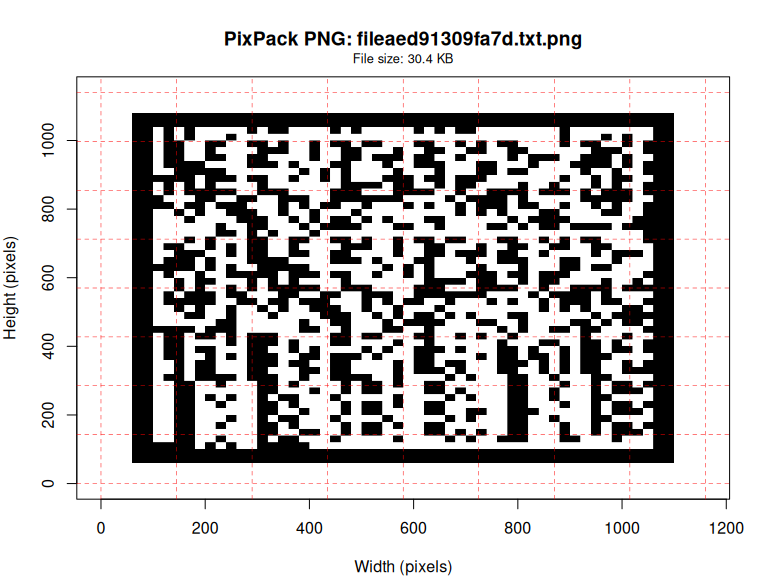

# Rpixpack: R Bindings for PixPack

Turn **any file into a single PNG** whose **pixels carry the data** -
now from R! Feed that PNG back in to **recover the exact original** with
strong integrity checks.

This package provides R bindings for the excellent
[PixPack](https://github.com/SauersML/pixpack) utility, allowing you to
encode and decode files directly from R.

## Installation

You’ll need Rust installed on your system. Install from
[rustup.rs](https://rustup.rs/).

``` r
install.packages('Rpixpack', repos = c('https://sounkou-bioinfo.r-universe.dev', 'https://cloud.r-project.org'))
```

## Quick Start

``` r
library(Rpixpack)
```

### Text Encoding Example

``` r
# Encode text to PNG
png_file <- tempfile(fileext = ".png")
result <- pixpack_text("Hello, PixPack from R! 🚀📊", png_file)
#> Encoding text to PNG...
#> Created PNG: /tmp/Rtmpv2sDqC/file962a76aa040f.png
cat("Created PNG:", result, "\n")
#> Created PNG: /tmp/Rtmpv2sDqC/file962a76aa040f.png

# Decode PNG back to text
decoded <- pixpack_text(png_path = png_file)
#> Decoding PNG to text...
#> Decoded 25 characters
cat("Decoded text:", decoded, "\n")
#> Decoded text: Hello, PixPack from R! 🚀📊

# Show file info
info <- pixpack_info(png_file)
print(info)
#> PixPack File Info:
#>   File: file962a76aa040f.png 
#>   Size: 26.28 KB
#>   Type: Possibly PixPack PNG (use pixpack_plot for visualization) 
#>   Modified: 2025-08-14 20:01:42
```

### File Encoding Example

``` r
# Create a test file with some content
test_file <- tempfile(fileext = ".txt")
test_content <- c(
  "# Sample Data File",
  "timestamp,value,category", 
  "2024-01-01,42.5,A",
  "2024-01-02,38.1,B", 
  "2024-01-03,51.2,A"
)
writeLines(test_content, test_file)

# Encode file to PNG
png_result <- pixpack_convert(test_file, verbose = TRUE)
#> Encoding file to PNG...
#> Output: /tmp/Rtmpv2sDqC/file962a52c4c02b.txt.png

# Decode PNG back to original file
decoded_file <- pixpack_convert(png_result, verbose = TRUE)
#> Decoding PNG to original file...
#> Output: /tmp/Rtmpv2sDqC/file962a52c4c02b.txt

# Verify the content is preserved
original_content <- readLines(test_file)
decoded_content <- readLines(decoded_file)
cat("Content preserved:", identical(original_content, decoded_content), "\n")
#> Content preserved: TRUE
```

### Visualization

``` r
# Visualize the PixPack PNG structure
pixpack_plot(png_result, show_grid = TRUE)
```



    #> PixPack PNG visualized. Dimensions: 1160x1140

### Binary File Testing

``` r
# Test with binary data
binary_data <- as.raw(c(0:255, 255:0, rep(42, 100)))
binary_file <- tempfile(fileext = ".bin")
writeBin(binary_data, binary_file)

# Encode binary file
png_binary <- pixpack_convert(binary_file, verbose = TRUE)
#> Encoding file to PNG...
#> Output: /tmp/Rtmpv2sDqC/file962a7b8f0bef.bin.png

# Decode and verify
decoded_binary <- pixpack_convert(png_binary, verbose = TRUE)
#> Decoding PNG to original file...
#> Output: /tmp/Rtmpv2sDqC/file962a7b8f0bef.bin
original_binary <- readBin(binary_file, "raw", n = length(binary_data))
restored_binary <- readBin(decoded_binary, "raw", n = length(binary_data))

cat("Binary data preserved:", identical(original_binary, restored_binary), "\n")
#> Binary data preserved: TRUE
cat("Original length:", length(original_binary), "bytes\n")
#> Original length: 612 bytes
cat("Restored length:", length(restored_binary), "bytes\n")
#> Restored length: 612 bytes
```

### Low-level API Testing

``` r
# Test direct API functions
test_text <- "Direct API test: 你好世界! 🎉"
direct_png <- tempfile(fileext = ".png")

# Use StringConversion directly
result_path <- StringConversion(test_text, direct_png)
cat("StringConversion result:", result_path, "\n")
#> StringConversion result: /tmp/Rtmpv2sDqC/file962a666a8030.png

# Decode using StringConversion
decoded_text <- StringConversion("", direct_png)
cat("Decoded text:", decoded_text, "\n")
#> Decoded text: Direct API test: 你好世界! 🎉
cat("Roundtrip success:", identical(test_text, decoded_text), "\n")
#> Roundtrip success: TRUE

# Test fileConversion directly
test_doc <- tempfile(fileext = ".txt")
writeLines(c("# Test Document", "This is a test.", "Line 3"), test_doc)

direct_png2 <- fileConversion(test_doc)
cat("fileConversion created:", direct_png2, "\n")
#> fileConversion created: /tmp/Rtmpv2sDqC/file962a4fd0371d.txt.png

# Decode back
restored_doc <- fileConversion(direct_png2)
cat("fileConversion restored:", restored_doc, "\n")
#> fileConversion restored: /tmp/Rtmpv2sDqC/file962a4fd0371d.txt

# Verify content
original_lines <- readLines(test_doc)
restored_lines <- readLines(restored_doc)
cat("File content preserved:", identical(original_lines, restored_lines), "\n")
#> File content preserved: TRUE
```

### Large File Testing

``` r
# Test with larger content
large_text <- paste(rep("This is a longer test string with more content to encode. ", 50), collapse = "")
large_png <- tempfile(fileext = ".png")

# Measure encoding time
start_time <- Sys.time()
large_result <- pixpack_text(large_text, large_png, verbose = TRUE)
#> Encoding text to PNG...
#> Created PNG: /tmp/Rtmpv2sDqC/file962a6b5aafd1.png
encode_time <- Sys.time() - start_time

# Measure decoding time
start_time <- Sys.time()
large_decoded <- pixpack_text(png_path = large_png, verbose = TRUE)
#> Decoding PNG to text...
#> Decoded 2900 characters
decode_time <- Sys.time() - start_time

cat("Large text length:", nchar(large_text), "characters\n")
#> Large text length: 2900 characters
cat("Encoding time:", round(as.numeric(encode_time, units = "secs"), 3), "seconds\n")
#> Encoding time: 0.33 seconds
cat("Decoding time:", round(as.numeric(decode_time, units = "secs"), 3), "seconds\n")
#> Decoding time: 0.172 seconds
cat("Large text preserved:", identical(large_text, large_decoded), "\n")
#> Large text preserved: TRUE

# Show file sizes
png_size <- file.info(large_png)$size
cat("PNG file size:", round(png_size / 1024, 1), "KB\n")
#> PNG file size: 257.3 KB
cat("Compression ratio:", round(nchar(large_text) / png_size, 2), "\n")
#> Compression ratio: 0.01
```

## Core Functions

- `pixpack_convert(file_path)`: Auto-detect encode/decode based on file
  type
- `pixpack_text(text, png_path)`: Encode text to PNG or decode PNG to
  text  
- `pixpack_plot(png_path)`: Visualize PixPack PNG structure
- `pixpack_info(file_path)`: Get file information

## Low-level Functions

- `fileConversion(path)`: Direct file encoding/decoding (auto-detect)
- `StringConversion(input, png_path)`: Direct string encoding/decoding

## How PixPack Works

- Renders a **macro-cell grid** with a **white quiet zone** and **black
  frame**.
- Packs: `MAGIC | VERSION | header (×2) | payload | trailer_u32`.
  - **Header**: filename, total length, full BLAKE3, grid hints.
  - **Trailer**: first 4 bytes of BLAKE3(payload) for a fast sanity
    check.
- **Decode**: grayscale → Otsu threshold (with a few fallbacks) → infer
  frame/quiet → sample **center pixel per cell** → rebuild stream.
- **Integrity**:
  - Encode: re-open the written PNG, decode it back, verify **length +
    full BLAKE3 + byte-for-byte**.
  - Decode: after writing the file, re-hash and verify **length + full
    BLAKE3** again.
- Capacity is **1 bit per data cell**; pixpack picks a near-square grid
  and a cell size capped by a max canvas side.

## Testing

Run the test suite:

``` r
# Run tests
tinytest::run_test_dir(system.file("tinytest", package = "Rpixpack"))
```

## Credits

- **Original PixPack**: Created by
  [SauersML](https://github.com/SauersML/pixpack)
- **R Bindings**: Implemented using the
  [savvy](https://github.com/yutannihilation/savvy) framework
- **Integration**: Built with Rust-R FFI for high performance

## License

MIT License - see LICENSE file for details.

## Repository

- **Original PixPack**: <https://github.com/SauersML/pixpack>
- **R Bindings**: <https://github.com/sounkou-bioinfo/pixpack>
